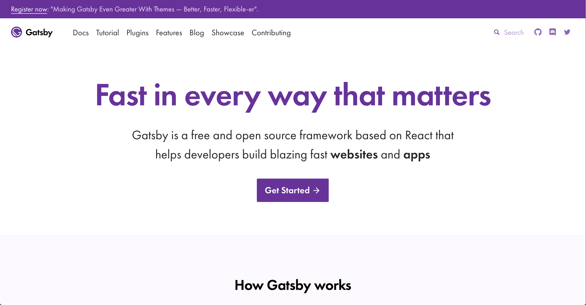

## はじめに

こんにちは、香港に住んでいるWEBデベロッパーのなかむ（[@nakanakamu0828](https://twitter.com/nakanakamu0828)）です。

今回は、[GatsbyJS](https://www.gatsbyjs.org/)を利用してポートフォリオサイトを構築したいと思います。
私がメンタリングしている生徒さんがポートフォリオサイトをGatsbyJSで構築したいと勉強していたことがきっかけとなり、私も構築してみることにしました。

## GatsbyJSとは

> Gatsby is a free and open source framework based on React that helps developers build blazing fast websites and apps

GatsbyJSは、ReactJSで構築された静的ジェネレーターで高速にWebサイトやアプリを構築するためのサポートを行うオープンソースのフレームワークです。




## なぜGatsbyJSを利用したか？
上述しましたが、きっかけは、私がメンタリングしている生徒さんがGatsbyJSを利用してポートフォリオを作りたいと相談されたことです。
その他にもGatsbyJSを利用したかった理由がありますので以下に記載します。

- GatsbyJS、ReactJSの経験が浅かったので実績を作りたかった
- Gridsomeにて簡単な[デモサイト](https://gridsome-starter-site.netlify.com/)の構築経験があったので、静的ジェネレーターとして善し悪しを比較したかった
- 今後、ホームページやコーポレートサイトを構築するときにGatsbyJSで構築できるようにノウハウを身につけておきたかった


## ポートフォリオサイトの構成について
基本的には個人の紹介サイトになる為、Home画面を利用したシングルページ構成で自己紹介や経歴紹介、問い合わせを用意しています。  
＋αの情報をブログとして記事にしていきます。


## 利用しているプラグイン/ライブラリは？
追加した主なプラグイン/ライブラリを紹介します。

### GatsbyJSのプラグイン
- [gatsby-plugin-react-helmet](https://www.gatsbyjs.org/packages/gatsby-plugin-react-helmet/) : react-helmetを利用してmetaタグを生成する
- [gatsby-transformer-sharp](https://www.gatsbyjs.org/packages/gatsby-transformer-sharp/) : 画像読み込みでImageSharpノードを生成する
- [gatsby-plugin-sharp](https://www.gatsbyjs.org/packages/gatsby-plugin-sharp/) : 画像圧縮ライブラリの[Sharp](https://github.com/lovell/sharp)を使えるようにする
- [gatsby-plugin-postcss](https://www.gatsbyjs.org/packages/gatsby-plugin-postcss/) : PostCSSを利用する為のライブラリ。TailwindCSSを利用するために追加
- [gatsby-plugin-sitemap](https://www.gatsbyjs.org/packages/gatsby-plugin-sitemap/) : sitemap.xmlを生成する
- [gatsby-plugin-styled-components](https://www.gatsbyjs.org/packages/gatsby-plugin-styled-components/) : styled-componentを利用する
- [gatsby-source-filesystem](https://www.gatsbyjs.org/packages/gatsby-source-filesystem/) : プロジェクト内に作成されたmarkdownファイルを読み込むAPI
- [gatsby-transformer-remark](https://www.gatsbyjs.org/packages/gatsby-transformer-remark/) : markdownを[remark](https://remark.js.org/)を利用してHTMLに変換する
- [gatsby-remark-images](https://www.gatsbyjs.org/packages/gatsby-remark-images/) : markdownの画像を表示する
- [gatsby-remark-external-links](https://www.gatsbyjs.org/packages/gatsby-remark-external-links/) : 外部リンクは target="_blank" rel="nofollow, noopener, noreferrer"を設定する
- [gatsby-remark-autolink-headers](https://www.gatsbyjs.org/packages/gatsby-remark-autolink-headers/) : 見出しにid属性をつける
- [gatsby-remark-toc](https://www.gatsbyjs.org/packages/gatsby-transformer-remark/) : markdownから目次を生成する
- [gatsby-remark-prismjs](https://www.gatsbyjs.org/packages/gatsby-remark-prismjs/): コードハイライトとして[prismjs](https://prismjs.com/)を利用
- [gatsby-plugin-alias-imports](https://www.gatsbyjs.org/packages/gatsby-plugin-alias-imports/) : import宣言のaliasとして利用。

```javascript
import '@components/navbar'
↓
import '../../components/navbar.js'
```

- [gatsby-plugin-netlify](https://www.gatsbyjs.org/packages/gatsby-plugin-netlify/) : Netlifyの_redirecsファイルを生成するのに利用しています

### それ以外のライブラリ
- [TailwindCSS](https://tailwindcss.com/docs/what-is-tailwind/) : デザインのベースは[TailwindCSS](https://tailwindcss.com/docs/what-is-tailwind/)でマークアップしています
- [react-inview-monitor](https://www.npmjs.com/package/react-inview-monitor) : inview(画面内に要素が表示された)時にアニメーションを行う


## 利用方法

```bash
$ gatsby new [project name] https://github.com/nakanakamu0828/gatsby-starter-portfolio
$ cd [project name]
$ gatsby develop
```
※　[project name]は任意の名称を指定してください。プロジェクトルートのディレクトリ名になります


## 最後に
本サイトのソースコードはgithubの[nakanakamu0828/gatsby-starter-portfolio](https://github.com/nakanakamu0828/gatsby-starter-portfolio) をご確認ください。
サンプル的なものになりますが、お役に立てた際はStarなど頂けると幸いです。

<iframely href="https://github.com/nakanakamu0828/gatsby-starter-portfolio"></iframely>